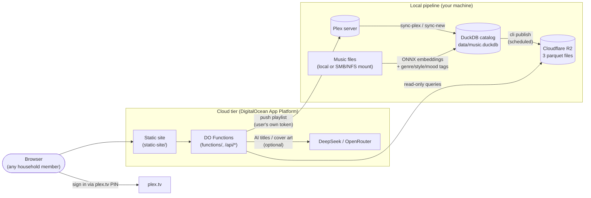

# SynthDigger

*Know your library by its sound.*

Build a searchable, semantic index of your Plex music library and use it to generate discovery playlists — locally from the CLI, or from anywhere through a self-hosted web app.

> **New to this / setting it up for someone less technical?** There's a step-by-step,
> plain-language setup guide in the [project wiki](https://github.com/bmewing/synthdigger/wiki).
> This README is the technical reference.

The **local pipeline** pulls track metadata and play history from Plex, extracts a semantic audio embedding for every track (Discogs-EffNet, run locally via ONNX), trains genre/style/mood taggers, and stores everything in a single-file DuckDB catalog — no database server required. The **cloud tier** (optional) publishes a read-only snapshot of that index to Cloudflare R2 and serves a small web app from DigitalOcean App Platform, where anyone with access to your Plex server can sign in with their own Plex account, generate playlists, and push them straight to Plex — complete with an AI-generated title and cover art.

Everything runs against your own Plex server and your own storage. The only outside calls are optional: DeepSeek for playlist titles/cover prompts and OpenRouter for cover art. Leave them unconfigured and the rest works fine.

---

## Architecture



The cloud tier is stateless and read-only: it serves parquet snapshots from R2 and resolves each user's Plex connection at login through the plex.tv PIN flow, filtered to your server by its machine ID. Only Plex accounts with access to your server can use the app. Play-count freshness comes from re-running `publish` on a schedule (see `scripts/`).

---

## What's in here

* **Embedding extraction** — Discogs-EffNet semantic audio embeddings (1280-dim) for every track, run locally via ONNX Runtime.
* **Plex sync** — pulls track/artist/album metadata, play counts, and last-played timestamps into a single-file DuckDB catalog.
* **Genre, style, and mood tagging** — a 400-class Discogs genre classifier plus trained linear probes for AllMusic style/mood tags.
* **Playlist generation** — cosine-similarity based, with diversity constraints (artist/album repeat windows, minimum unique artists) and a "discovery" bias toward unplayed or rarely-played tracks. Can seed from a song, mood, style, genre, freeform prompt, or the last N days of listening activity (targeting music that's similar to, a step away from, or radically different from what you've actually been playing).
* **AI-generated titles and cover art** — optional, via DeepSeek (title + image prompt, one call) and OpenRouter (image generation), uploaded directly as the Plex playlist's poster.
* **Cloud web app** — a static site + serverless Functions deployment where each user signs in with their own Plex account (plex.tv PIN flow), generates playlists against the published index, and pushes them to Plex with per-user playlist history. See [docs/DEPLOYMENT.md](docs/DEPLOYMENT.md).

---

## Quickstart (local)

### 1. Install

```bash
python -m venv .venv

# Windows PowerShell:        .\.venv\Scripts\Activate.ps1
# Windows CMD:               .\.venv\Scripts\activate.bat
# macOS/Linux:               source .venv/bin/activate

# ml extra = embedding extraction / tagger training (librosa, onnxruntime, scikit-learn, ...)
pip install -e ".[ml]"
```

This installs the `synthdigger` command. Every example below written as
`python -m music_embeddings.cli <command>` can also be run as `synthdigger <command>` once the
venv is active — they're the same entry point. Check your install and version with:

```bash
synthdigger version
```

### 2. Configure

Copy `.env.example` to `.env` and fill in your values — at minimum `PLEX_URL` and `PLEX_TOKEN`. See the [environment variable reference](#environment-variable-reference) below.

### 3. Initialize the catalog and download the model

```bash
# Windows PowerShell: $env:PYTHONPATH="src"   |   macOS/Linux: export PYTHONPATH=src
python -m music_embeddings.database          # creates data/music.duckdb
python -m music_embeddings.cli download-model
```

The model is downloaded directly from the [MTG-UPF model registry](https://essentia.upf.edu/models/feature-extractors/discogs-effnet/discogs-effnet-bsdynamic-1.onnx) to `./models/discogs-effnet-bsdynamic-1.onnx`.

### 4. Build your library

```bash
# Extract embeddings from your music files (point at the same files Plex serves)
python -m music_embeddings.cli scan "path/to/music/directory"

# Pull metadata, play counts, and ratings from Plex and match them to the embeddings
python -m music_embeddings.cli sync-plex

# Later: embed + tag anything added to Plex since the last sync, in one step
python -m music_embeddings.cli sync-new
```

If the pipeline machine sees your music through a share or mount (rather than running on the Plex host itself), set `MUSIC_LIBRARY_ROOT` and `PLEX_MUSIC_FOLDERS` in `.env` so Plex-reported paths can be matched to your files.

### 5. Tag and train

```bash
python -m music_embeddings.cli predict-genres              # 400-class Discogs genre model
python -m music_embeddings.cli tag-labels-report           # coverage report for weak style/mood labels
python -m music_embeddings.cli train-tagger style          # linear probe from inherited album/artist tags
python -m music_embeddings.cli train-tagger mood
python -m music_embeddings.cli predict-tags style --to-db  # score every track
python -m music_embeddings.cli predict-tags mood --to-db
```

### 6. Generate playlists

```bash
# By genre, style, mood, seed song, or freeform prompt
python -m music_embeddings.cli playlist --genre "Rock" --count 50
python -m music_embeddings.cli playlist --prompt "rainy sunday morning"

# Based on the last 2 weeks of listening, aiming for something similar/adjacent/different
python -m music_embeddings.cli playlist --recent-days 14 --novelty similar
python -m music_embeddings.cli playlist --recent-days 14 --novelty step_away
python -m music_embeddings.cli playlist --recent-days 14 --novelty different

# With an AI-generated title and cover image (needs OPENROUTER_API_KEY)
python -m music_embeddings.cli playlist --recent-days 14 --ai-cover
```

Playlists are ranked by cosine similarity to the resolved target (a song, a label centroid, or a centroid of recent listening), sequenced to avoid artist/album repeats within a sliding window, and biased toward tracks that are unplayed or rarely played unless `--ignore-play-history` is passed. Use `--no-upload` to preview without pushing to Plex, and `--cover-image <url-or-path>` to set a specific cover manually.

Run `python -m music_embeddings.cli playlist --help` for the full flag list, including diversity tuning (`--min-artists`, `--artist-window`, `--album-window`) and label listing (`--list-moods`, `--list-styles`, `--list-genres`).

---

## Deploying the web app

Once the local index is built, you can host the web app so playlists can be generated from any browser:

1. Create a **Cloudflare R2** bucket and run `python -m music_embeddings.cli publish` to upload the three parquet snapshot files.
2. Fork this repo, copy `.do/app.yaml.example` to `.do/app.yaml`, and fill in your fork and secrets.
3. Create the app on **DigitalOcean App Platform** with `doctl apps create --spec .do/app.yaml`.
4. Schedule `publish` to keep play counts fresh (examples in `scripts/`).

The full walkthrough — including how the plex.tv PIN auth works and what is (and isn't) exposed publicly — is in **[docs/DEPLOYMENT.md](docs/DEPLOYMENT.md)**. The Functions backend is documented in [functions/README.md](functions/README.md).

---

## Environment variable reference

| Variable | Tier | Required | Notes |
|---|---|---|---|
| `DUCKDB_PATH` | local | no | Catalog file path. Default `./data/music.duckdb`. |
| `PLEX_URL` / `PLEX_TOKEN` | local | yes | Your Plex server's URL and an auth token; used for sync and CLI playlist push. |
| `MUSIC_LIBRARY_ROOT` | local | no | Where this machine can reach the music files (SMB/NFS/local). Unset = use Plex-reported paths (correct on the Plex host). |
| `PLEX_MUSIC_FOLDERS` | local | no | Comma-separated top-level music folder names (e.g. `Plex Music,Classical`) used to align Plex paths with scanned paths. |
| `MUSIC_EMBEDDING_MODEL_PATH` / `MUSIC_EMBEDDING_OUTPUT_DIR` | local | no | Default `./models/...` and `./data/embeddings`. |
| `OPENROUTER_API_KEY` | both | no | Single key for all AI features: playlist titles/cover prompts + freeform-vibe interpretation (DeepSeek models) and AI cover art. Blank = all skipped. |
| `OPENROUTER_TEXT_MODEL` / `OPENROUTER_IMAGE_MODEL` | both | no | Optional model overrides; default to DeepSeek v4-flash and Flux respectively. |
| `DISABLE_AI_FEATURES` | both | no | Set to `true` to hide the vibe input box and AI title/cover buttons and skip all AI calls, regardless of whether `OPENROUTER_API_KEY` is set. |
| `R2_ACCOUNT_ID` / `R2_ACCESS_KEY_ID` / `R2_SECRET_ACCESS_KEY` / `R2_BUCKET` | both | cloud only | R2 credentials: `publish` writes the snapshot, Functions read it (and store covers/history). |
| `PLEX_SERVER_MACHINE_ID` | cloud | yes (cloud) | Your server's stable `machineIdentifier`; Functions use it to pick your server among a signed-in account's resources. |
| `SESSION_SECRET_KEY` | cloud | yes (cloud) | HMAC key for the session cookie. Generate with `python -c "import secrets; print(secrets.token_urlsafe(32))"`. Must be identical across all Functions. |

---

## Technical overview

### Audio fingerprint vs. semantic music embedding

* **Audio fingerprint (e.g., Shazam, AcoustID/Chromaprint):** identifies the *exact* same recording via time-frequency landmarks. Robust to noise, but fails on a different performance or style. Used for identification.
* **Semantic music embedding (e.g., Discogs-EffNet):** captures *conceptual similarity* (genre, mood, instrumentation, structure, era) as a dense 1280-dim vector. Two recordings of the same song — or two songs in the same sub-genre — land close together in vector space. Used for recommendation, clustering, and semantic search.

### Extraction specifications

* **Audio preprocessing:** decoded to float32, downmixed to mono, resampled to **16,000 Hz**.
* **Mel-spectrogram:** 512-sample Hann window/FFT, 256-sample hop (no centering), 96 Slaney-scale mel bands normalized by peak height, log-compression `log10(10000 * mel + 1)`.
* **Patching:** 128-frame patches with a 62-frame hop.
* **Aggregation:** per-patch L2 normalization, mean across the track, final L2 normalization.
* **Output:** 1280-dimensional float32 vector with unit L2 norm.

Feature extraction is implemented in Python with `librosa` + `onnxruntime`, configured to match the preprocessing the Discogs-EffNet model was trained with (as documented by MTG-UPF). Essentia itself is not a dependency — this also sidesteps the lack of Essentia wheels for Windows/Python 3.12.

### Supported environment

* **OS:** Windows, macOS, Linux.
* **Python:** 3.10+ (developed on 3.12).
* **Storage:** a single DuckDB file — no database server to install. If you're migrating from the earlier Postgres-based version of this project, run `python scripts/migrate_pg_to_duckdb.py` once.

---

## Tests

```bash
# Windows PowerShell: $env:PYTHONPATH="src"   |   macOS/Linux: export PYTHONPATH=src
python -m pytest tests
```

Covers embedding correctness (L2 normalization, zero-vector rejection, NaN/inf handling, patch aggregation, deterministic hashing), genre-selection thresholding, the tagger's label-matrix assembly, and playlist novelty/candidate-pool selection. The embedder's integration test runs automatically if the model weights have been downloaded.

---

## Licensing and attribution

* **This repository:** [GNU Affero General Public License v3.0](LICENSE) (AGPL-3.0). If you run a modified version as a network service, you must offer its source to your users.
* **Discogs-EffNet pretrained model:** created by Pablo Alonso, Xavier Serra, and Dmitry Bogdanov (MTG-UPF); published at *ISMIR 2022* ("Music Representation Learning Based on Editorial Metadata from Discogs"). The weights are distributed by MTG-UPF for **research and academic purposes** under their own terms — they are **not** covered by this repository's license and are never redistributed here; each user downloads them directly from MTG-UPF via `cli download-model`.
* **Essentia:** not a dependency of this project. The extraction pipeline reimplements the model's published preprocessing parameters using `librosa`; the Essentia project (AGPL-3.0) is gratefully acknowledged as the source of the model and its documentation.
