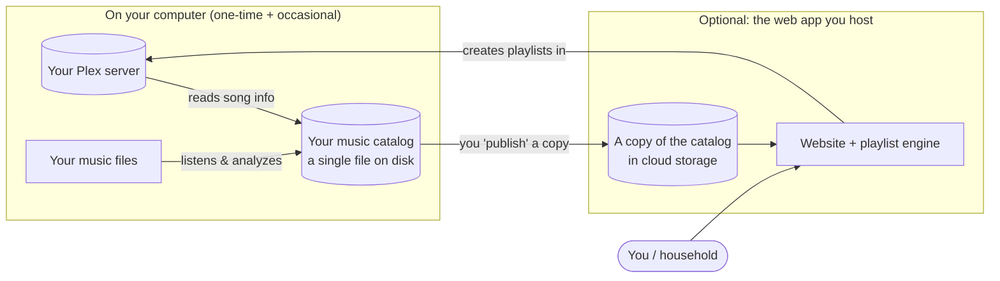

# Overview and How It Works

A plain-English picture of what SynthDigger does. No technical background needed.

## The idea

Most music apps recommend songs based on what *other people* listened to. SynthDigger is
different: it listens to the actual **audio** of every track in your Plex library and
learns what each one sounds like — its genre, mood, instruments, energy, era. Songs that
*sound* alike end up "near" each other, so SynthDigger can build a playlist by starting
from one song, a mood, a genre, or even a freeform idea like *"rainy day"* and finding the
tracks that fit.

Because it works from the sound itself, it can surface songs you forgot you owned — the
whole point of "digging" through your collection.

## The two halves

1. **On your computer.** The `synthdigger` tool connects to your Plex server, reads the
   list of songs and how often they've been played, and listens to each audio file to
   build a **catalog** — one file on your disk (`data/music.duckdb`). This is where the
   "analysis" happens, and it's the one part that takes a while. You can make playlists
   right from here.

2. **The web app (optional).** If you want family or roommates to make playlists too, you
   **publish** a read-only copy of the catalog to free cloud storage and host a small
   website. Everyone signs in with their *own* Plex account and builds playlists that get
   saved straight to Plex.

## What leaves your computer?

- **Your music files: never.** Only the *analysis* (numbers describing each song) and text
  like song titles and play counts are used. No audio is ever uploaded.
- **For the web app**, that analysis and the song/artist/album names are copied to your own
  private cloud storage so the website can read them.
- **Optional AI features** (playlist titles and cover art) send a short text description to
  an AI service. Turn these off and nothing goes out. See [[09 Optional AI Features OpenRouter]].

## Who can use the web app?

Only people who already have access to **your** Plex server. Signing in happens through
Plex itself — if Plex doesn't recognize someone as having access to your server, they
can't get in. There are no separate passwords to manage. Details in [[13 Using the Web App]].

## Do I have to build the web app?

No. **Part A alone** (analyze your library, make playlists from the `synthdigger` command)
is fully useful on its own. Part B is only if you want the shared website.

---

**Next:** [[Glossary and FAQ]] to nail down any unfamiliar terms, then
[[01 Before You Start]].
